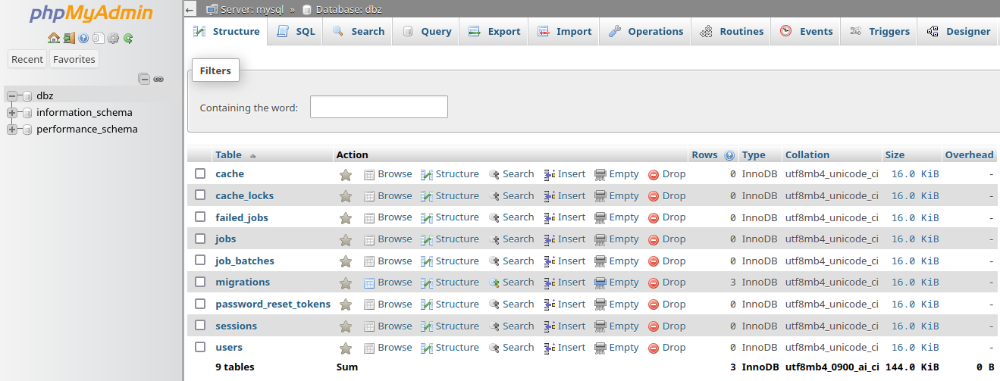

# cat-api

## Build from source:

```bash
cd .docker
make build
```

## Set-up

You should place "laravel" folder with laravel app in it, and "mysql" with an installation of mysql (and a database, of course).
If you don't have a mysql database placed, docker will create one for you.

### Environment variables

Inside *.docker* folder, create .env file with this content:

```bash
MYSQL_DATABASE=laravel
MYSQL_USER=writeUsernameHere
MYSQL_PASSWORD=writePasswordHere
MYSQL_ROOT_PASSWORD=writePasswordForRootHere
```

## If none laravel install is present, install it:

1. Enter into the container with:

```bash
docker compose exec laravel bash
```

2. Install Laravel with composer (*--prefer-dist* will download Laravel as one compressed file. It's faster)

```bash
composer create-project --prefer-dist laravel/laravel .
```

3. Enter into .docker folder and do:

```bash
make up
```

Docker container will start with all their 4 services (nginx, laravel, mysql, phpmyadmin)

## Configure Laravel to use MySQL

Inside *laravel* folder, enter into *.env* file and catch this line:

```bash
DB_CONNECTION=sqlite
```

Change **sqlite** to **mysql**. Then use MYSQL_DATABASE, MYSQL_USER, MYSQL_PASSWORD and MYSQL_ROOT_PASSWORD variables from *.env* file in *.docker* folder to populate **DB** *.env* vars inside *laravel* folder. Mine looks like this:

```bash
DB_CONNECTION=mysql
DB_HOST=mysql
DB_PORT=3306
DB_DATABASE=dbz
DB_USERNAME=writeUserForDBHere
DB_PASSWORD=writePasswordForRootHere
```

Make sure you have this line into your *.env* file, inside *laravel* folder:

```bash
SESSION_DRIVER=database
```

Now you have to restart docker, so inside *.docker* folder you need to execute:

```bash
make stop
make up
```

Then, execute bash inside container:

```bash
php artisan key:generate
php artisan migrate:refresh
php artisan migrate
```

This should migrate the db to mysql and get things ready for use.



## Address permission issues

I had permission issues and fresh-installed Laravel can't continue because can't write inside *laravel* folder. Also, I can't read or write inside that folder because the user who's editing code in my VSCode is santiago, and the user of the folder is www-data, indeed. I solved with these two commands:

In parent folder (where *.docker* it's placed, and probably *laravel* and *mysql* too) do this as **sudo**:

```bash
chmod 777 -R laravel
chmod 777 -R mysql
chown -R www-data:www-data laravel # just to be sure
```